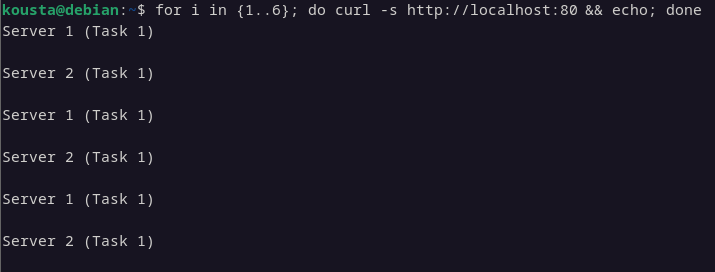
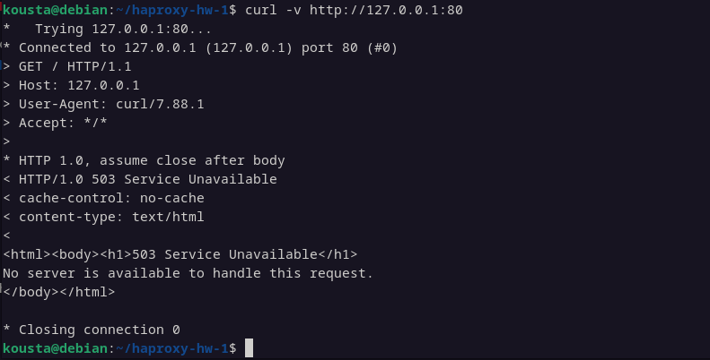

# Домашнее задание: HAProxy и Python-сервера

В рамках домашнего задания настроены балансировщики HAProxy и тестовые Python-серверы.  
Все конфигурационные файлы вынесены в каталог `configs/`, а скрипты запуска серверов — в каталог `scripts/`.  

---

# Задание 1 — Балансировка Round-Robin

### Запуск тестовых серверов
```bash
bash scripts/run_servers.sh

````

### Запуск HAProxy
```bash
sudo haproxy -f configs/task1-haproxy.cfg
```` 
### Проверка работы балансировщика Round-robin на 4 уровне

```bash
for i in {1..6}; do curl -s http://localhost:8080 && echo; done

````




#  Задание 2 - Балансировка HAProxy Weighted Round Robin на 7 уровне

## Описание
Три Python сервера на портах 8001, 8002 и 8003.  
HAProxy балансирует HTTP-трафик по домену example.local с Weighted Round Robin:
- Server 1: вес 2
- Server 2: вес 3
- Server 3: вес 4

# Запуск тестовых серверов 
```bash

bash scripts/run_servers_task2.sh
````
# Запуск HAProxy

```bash
sudo haproxy -f configs/task2-haproxy.cfg
````


## Проверка работы балансировщика Weighted Round Robin на 7 уровне

```bash
for i in {1..10}; do curl -s -H "Host: example.local" http://127.0.0.1; echo; done
````



### Конфигурационный файл HAProxy

- Задание 1: [configs/task1-haproxy.cfg](configs/task1-haproxy.cfg)
- Задание 2: [configs/task2-haproxy.cfg](configs/task2-haproxy.cfg)

---
