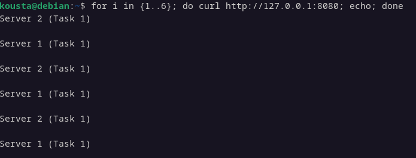
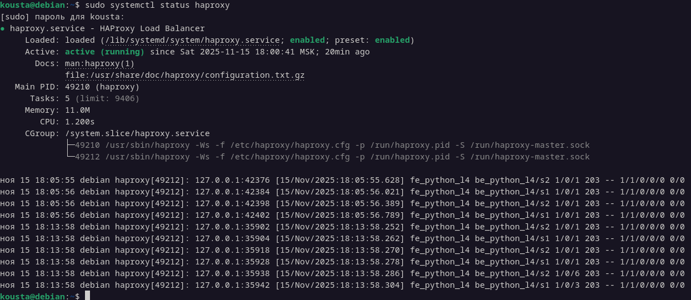
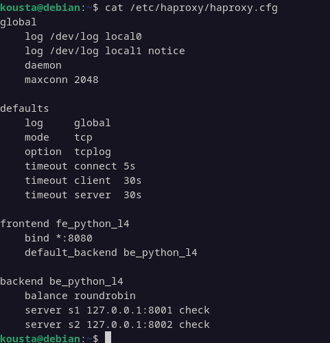
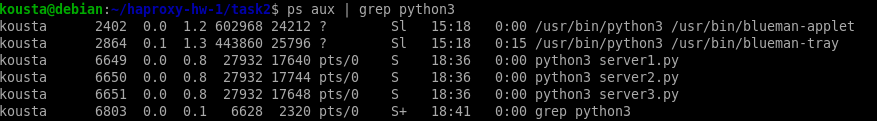
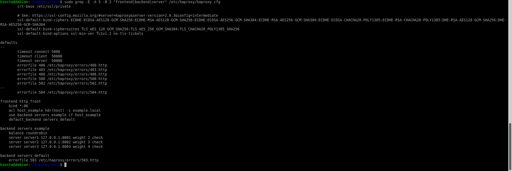
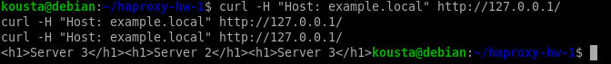
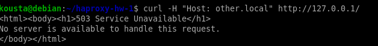

# Задание 1 — Round-Robin L4

## Проверка работы HAProxy

### Скриншот вывода curl:

### Скриншот состояния HAProxy:

### Конфигурационный файл HAProxy:

# Задание 2 - HAProxy + Python сервера

## Описание
Три Python сервера на портах 8001, 8002 и 8003.  
HAProxy балансирует HTTP-трафик по домену example.local с Weighted Round Robin:
- Server 1: вес 2
- Server 2: вес 3
- Server 3: вес 4

## Запуск
1. ./run_servers.sh
2. sudo haproxy -f haproxy.cfg

## Проверка
- http://example.local → распределение запросов между серверами
- http://localhost → 503

### Скриншот состояния Python-серверов:

### Скриншот конфигурационного файла HAProxy:

### Скриншот перенаправления запросов на разные серверы (example.local):

### Скриншот проверки запросов на другой домен:

